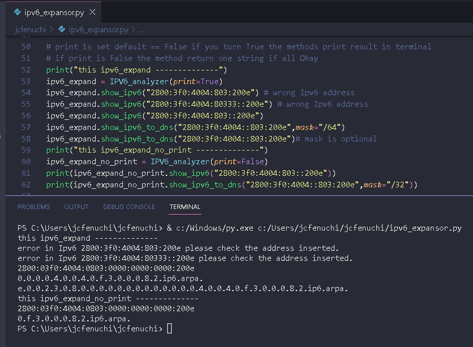

#
## Python ♥ code to expand ipv6 address
#### this code is a easy way to use IPV6, because ipv6 needs expand and this code make this.
#
##### for other hand this code make a start of file of reverse zone to the DNS( PTR ), and you dont need make this hard work again :)  

### example of this code running:

##### ipv6 address of this example belongs to google
##### feel free to improve it.

#
##### PT-BR ↓
## codigo para expandir IPV6
#### codigo facilitador para ultilizar Ipv6, e reduzindo o tempo necessario para realizar sua expansão.
##### alem da expansão, esse codigo foi feito para auxilio na criação de zonas PTR no DNS. pois precisam ser na ordem reversa oque pode causa algum erro humano. 
